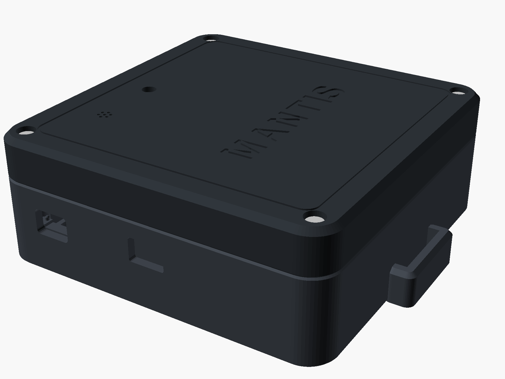
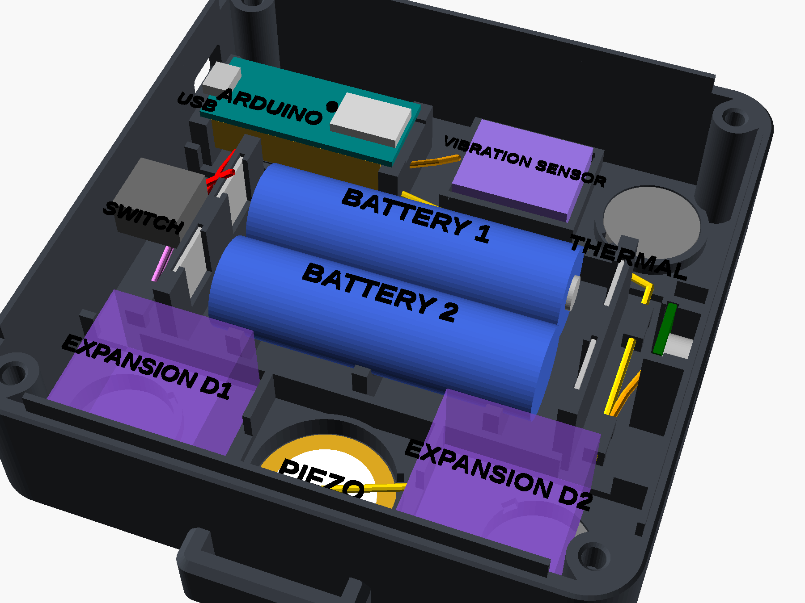

# MANTIS

**Multimodal Autonomous Non-Invasive Technical Inspection System.** MANTIS is a portable device that
sticks to a machine with magnets. It measures vibration, sound and temperature without touching the
machine's internals, and streams the results live to a phone or computer over Bluetooth LE.

**Live dashboard:** https://sl11k.github.io/mantis/

  
  

| Folder | Contents |
|---|---|
| [`app/`](app/) | Web dashboard (Web Bluetooth / Web Serial). It is deployed to GitHub Pages on every push |
| [`firmware/MANTIS/`](firmware/MANTIS/) | Arduino firmware |
| [`mantis_enclosure.scad`](mantis_enclosure.scad) | Parametric OpenSCAD enclosure (FDM) |
| [`stl/`](stl/) | Ready-to-print top and bottom shells |
| [`preview/`](preview/) | Renders: internal layout, exploded view, sides, machine face, section |

## What it measures

Every ~1.1 s:

- **Vibration.** The LSM9DS1 accelerometer samples at ~930 Hz and each axis gets a 1024-point FFT. From that the device reports:
  - velocity RMS over 10–475 Hz, with the **ISO 10816** zone (A good, B acceptable, C needs attention, D danger) for machine classes I–IV
  - acceleration RMS and peak
  - the dominant frequency
  - a 64-band velocity spectrum
- **Sound.** A-weighted sound level in dB(A) from the on-board PDM microphone. The calibration comes from the datasheets and is approximate (±3 dB); `MIC_CAL_DB` trims it against a reference meter.
- **Inside the enclosure.** Temperature and humidity (HTS221) and pressure (LPS22HB).
- **Surface temperature** (optional). An MLX90614 IR thermometer looks through the side window and is detected automatically when plugged in.
- **Contact / impacts** (optional). A piezo disc on the machine face.

## Hardware

| Part | Notes |
|---|---|
| Arduino Nano 33 BLE Sense **Rev1** | IMU, environmental sensors, microphone and BLE on board |
| MLX90614 / GY-906 IR module (optional) | I²C on A4 (SDA) / A5 (SCL), address 0x5A |
| Piezo disc, 27 mm (optional) | Analog input A0. Set `PIEZO_ENABLED = true` in the firmware |
| 2 × 18650 cells + spring/plate contacts | 2S into VIN through the power switch |
| KCD11 mini rocker (13 × 8.5 mm) or small slide switch | Left wall |
| 4 × Ø20 × 5 mm magnets | Glued into pockets from the inside, 0.8 mm skin to the machine face |
| 4 × M3 × 16 screws + M3 heat-set inserts | Or self-tapping: set `boss_hole_diameter = 2.5` |
| 5 mm LED or light pipe, Ø10 mm rubber pads, 25 mm hook-and-loop strap | Optional |

## Firmware

1. Install the Arduino IDE. In Boards Manager, add **Arduino Mbed OS Nano Boards** (tested with 4.6.0). In Library Manager, add **ArduinoBLE** (tested with 2.1.0). `PDM` and `Wire` come with the board package.
2. Open `firmware/MANTIS/MANTIS.ino`, choose **Arduino Nano 33 BLE** and the board's port, then upload.
3. Settings are at the top of the file: `PIEZO_ENABLED`, `PIEZO_PIN`, `PIEZO_IMPACT_MV`, the default `isoClass`, and `MIC_CAL_DB`.

Outputs:

- **BLE:** advertises as `MANTIS`, service `4d414e54-4953-4e53-5045-435400000000`. The full packet layout is documented in the header of `MANTIS.ino`.
- **USB serial (115200):** one JSON line per measurement window. Lines starting with `#` are human-readable.
- **Commands:** over USB, `C1`…`C4` set the ISO class, `I` blinks the LED, and `M` dumps 4096 raw microphone samples for diagnostics. The same commands go over BLE through the control characteristic.
- **On-board LED:** shows the zone colour. It blinks while waiting for a connection and stays solid once connected. Blue means no data yet.

## Enclosure

The enclosure is 120 × 120 × 45 mm and split at 30 mm. It is fully parametric. Open the file in
OpenSCAD and set `view_mode` to `"bottom"` or `"top"`, then press F6 and export to STL. The `stl/` folder
already contains both shells at the default settings. Assert checks at the end of the file catch parts
that would collide.

The board dimensions in the file come from the Nano 33 BLE Sense **Rev2** datasheet. Rev1 has the same
footprint and mounting holes, but check the microphone port position (`mic_from_usb_end`) against your
board before printing the lid.

## Dashboard

Open https://sl11k.github.io/mantis/ in Chrome or Edge (desktop or Android), or in Bluefy on iPhone.
Then press **Connect Bluetooth** and pick **MANTIS**. It can be added to the home screen and works
offline after the first visit. For USB or local development, run `node app/serve.js` and open
http://localhost:8765. See [`app/README.md`](app/README.md).
